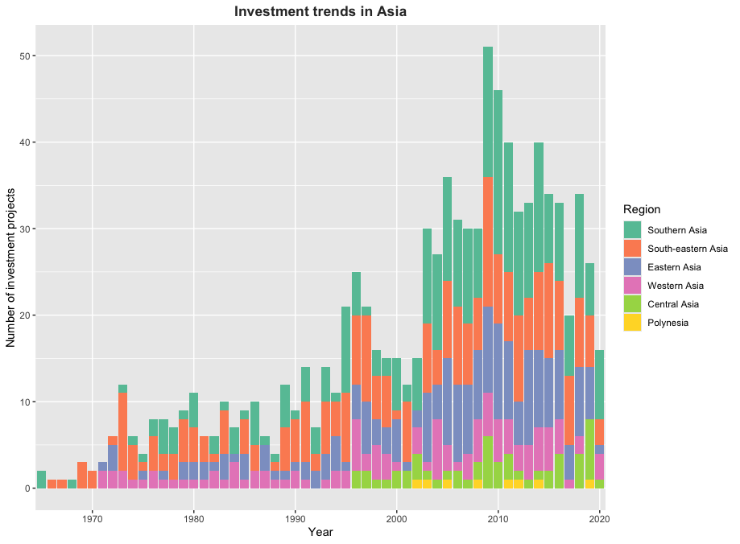
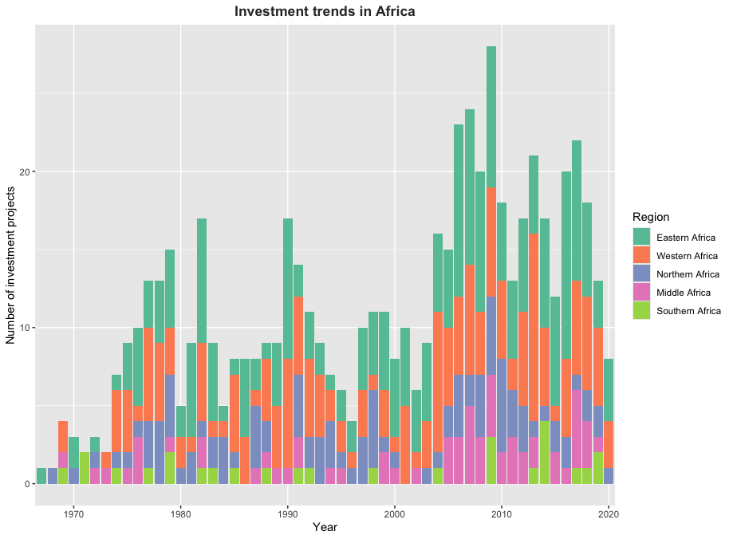

<!-- README.md is generated from README.Rmd. Please edit that file -->

```{r, include = FALSE}
knitr::opts_chunk$set(
  collapse = TRUE,
  comment = "#>",
  fig.path = "man/figures/README-",
  out.width = "100%",
  message = FALSE,
  warning = FALSE,
  fig.retina = 2,
  fig.align = 'center'
)

library(tidyverse)
library(epoxy)
library(washinvestments)
```

# washinvestments

<!-- badges: start -->

<!-- badges: end -->

The goal of washinvestments is to provide users documentation on the data set published alongside the article "Multilateral
development banks investment behaviour in water and sanitation: Findings
and lessons from 60 years of investment projects in Africa and Asia"
[@heidler2023multilateral].

## Installation

You can install the development version of washinvestments from
[GitHub](https://github.com/) with:

``` r
# install.packages("devtools")
devtools::install_github("openwashdata/washinvestments")
```

Alternatively, you can download the dataset as a CSV or XLSX file from
the table below.

```{r, echo=FALSE, message=FALSE, warning=FALSE}

extdata_path <- "https://github.com/openwashdata/washinvestments/raw/main/inst/extdata/"

read_csv("data-raw/dictionary.csv") |> 
  distinct(file_name) |> 
  dplyr::mutate(file_name = str_remove(file_name, ".rda")) |> 
  dplyr::rename(dataset = file_name) |> 
  mutate(
    CSV = paste0("[Download CSV](", extdata_path, dataset, ".csv)"),
    XLSX = paste0("[Download XLSX](", extdata_path, dataset, ".xlsx)")
  ) |> 
  knitr::kable()

```

## Project goal

Multilateral development banks (MDBs) significantly influence water and
sanitation infrastructure development. However, data on their investments is
dispersed and hard to compare. This project presents a new data set
compiled by drawing on 3,639 water and sanitation projects that aims at
assessing "territorial trends, technology choices, distribution of
financial burdens, and reforms to institutional arrangements to analyze
the investment behaviour of the World Bank, ADB, and AfDB in water
supply and sanitation from their first operations in the 1960s until
2020 and distil how they responded to trends in urbanization and the
policy debates about governing access to basic services."
[@heidler2023multilateral]

## Data

The data set includes information about water and sanitation projects
conducted in Africa and Asia between 1960 and 2020. The package provides
access to one data set.

```{r, echo = TRUE}
library(washinvestments)
```

The `washinvestments` data set has `r ncol(washinvestments)` variables
and `r nrow(washinvestments)` observations. For an overview of the
variable names, see the following table.

```{r, eval=FALSE}
washinvestments
```

```{r, echo=FALSE}
readr::read_csv("data-raw/dictionary.csv") |> 
  dplyr::filter(file_name == "washinvestments.rda") |> 
  dplyr::select(variable_name:description) |> 
  knitr::kable()
```

## Example: Investment trends in Africa and Asia over 60 years

Here is a basic example demonstrating how to address a common problem:
analyzing the evolution of financing in the WASH sector over
60 years. We focus on the continents mentioned in the paper: Africa
and Asia. The first plot below illustrates the number of investment projects
financed in the WASH sector from 1960 to 2020. It is evident that a
higher number of projects in Asia have secured financing. Furthermore,
there is a noticeable upward trend in the number of investment projects
over the years, reaching its peak in 2009. In a second place, we display the investment trends in Asia over 60 years, focusing on different regions within the continent. The third plot displays the investment trends in Africa over 60 years, focusing on different regions within the continent.





```{r, eval=FALSE, message=FALSE, warning=FALSE, include=TRUE, paged.print=FALSE}
library(washinvestments)
library(ggplot2)
library(countrycode)
library(dplyr)

washinvestments_asia_africa <- washinvestments |>
  mutate(continent = countrycode(iso_country_code, "iso3c", "continent")) |> 
  filter(continent %in% c("Africa", "Asia"))
continent_counts <- washinvestments_asia_africa |> 
  group_by(continent) |> 
  summarise(count = n()) |> 
  arrange(desc(count))
washinvestments_asia_africa$continent <- factor(washinvestments_asia_africa$continent, levels = continent_counts$continent)

washinvestments_asia <- washinvestments |>
  mutate(continent = countrycode(iso_country_code, "iso3c", "continent")) |> 
  filter(region %in% c("Central Asia", "Eastern Asia", "Polynesia", "South-eastern Asia", "Southern Asia", "Western Asia"))
asia_counts <- washinvestments_asia |> 
  group_by(region) |> 
  summarise(count = n()) |> 
  arrange(desc(count))
washinvestments_asia$region <- factor(washinvestments_asia$region, levels = asia_counts$region)

washinvestments_africa <- washinvestments |>
  mutate(continent = countrycode(iso_country_code, "iso3c", "continent")) |> 
  filter(region %in% c("Northern Africa", "Eastern Africa", "Middle Africa", "Western Africa", "Southern Africa"))
africa_counts <- washinvestments_africa |> 
  group_by(region) |> 
  summarise(count = n()) |> 
  arrange(desc(count))
washinvestments_africa$region <- factor(washinvestments_africa$region, levels = africa_counts$region)

ggplot(washinvestments_asia_africa, aes(x = year, fill = continent)) +
  geom_bar() +
  scale_x_discrete(breaks = seq(1960, 2020, 10)) +
  labs(title = "Investment trends in Africa and Asia",
       x = "Year",
       y = "Number of investment projects",
       fill = "Continent") +
  scale_fill_brewer(palette = "Set2") +
  theme(plot.title = element_text(hjust = 0.5, face = "bold", color = "#333333"))

ggplot(washinvestments_asia, aes(x = year, fill = region)) +
  geom_bar() +
  scale_x_discrete(breaks = seq(1960, 2020, 10)) +
  labs(title = "Investment trends in Asia",
       x = "Year",
       y = "Number of investment projects",
       fill = "Region") +
  scale_fill_brewer(palette = "Set2") +
  theme(plot.title = element_text(hjust = 0.5, face = "bold", color = "#333333"))

ggplot(washinvestments_africa, aes(x = year, fill = region)) +
  geom_bar() +
  scale_x_discrete(breaks = seq(1960, 2020, 10)) +
  labs(title = "Investment trends in Africa",
       x = "Year",
       y = "Number of investment projects",
       fill = "Region") +
  scale_fill_brewer(palette = "Set2") +
  theme(plot.title = element_text(hjust = 0.5, face = "bold", color = "#333333"))
```

## License

Data are available as
[CC-BY](https://github.com/openwashdata/washinvestments/LICENSE.md).

## Citation

To cite this package, please use:

```{r}
citation("washinvestments")
```
