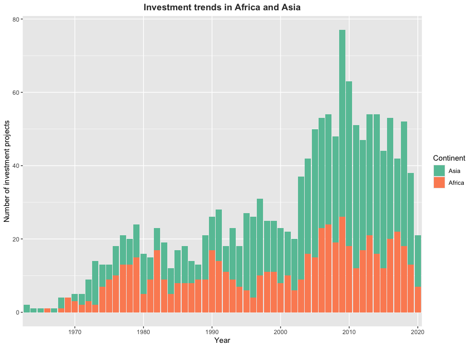
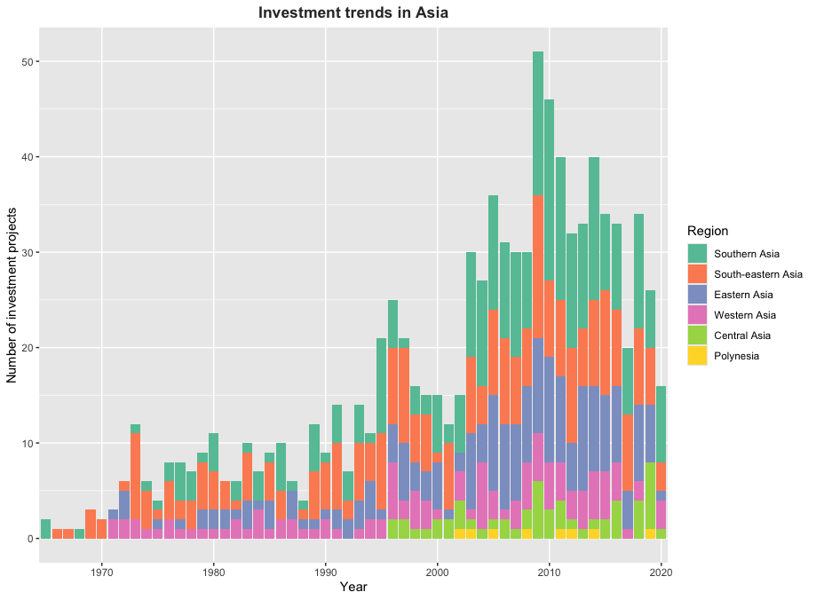
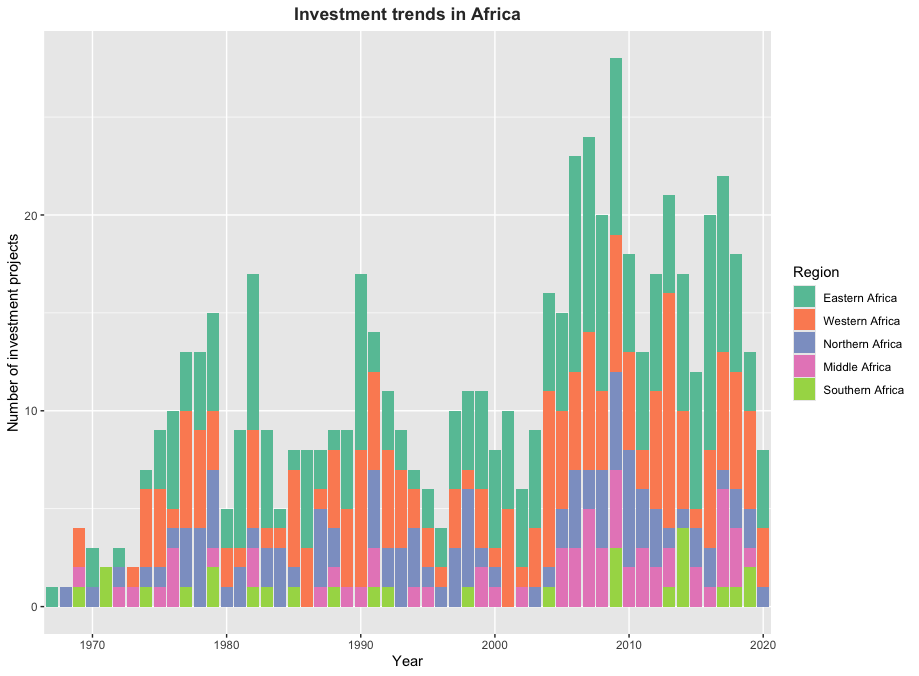

<!-- README.md is generated from README.Rmd. Please edit that file -->

# washinvestments

<!-- badges: start -->
<!-- badges: end -->

The goal of washinvestments is to provide users documentation on the
data set published alongside the article “Multilateral development banks
investment behaviour in water and sanitation: Findings and lessons from
60 years of investment projects in Africa and Asia” (Heidler et al.
2023).

## Installation

You can install the development version of washinvestments from
[GitHub](https://github.com/) with:

``` r
# install.packages("devtools")
devtools::install_github("openwashdata/washinvestments")
```

Alternatively, you can download the dataset as a CSV or XLSX file from
the table below.

| dataset         | CSV                                                                                                       | XLSX                                                                                                        |
|:----------------|:----------------------------------------------------------------------------------------------------------|:------------------------------------------------------------------------------------------------------------|
| washinvestments | [Download CSV](https://github.com/openwashdata/washinvestments/raw/main/inst/extdata/washinvestments.csv) | [Download XLSX](https://github.com/openwashdata/washinvestments/raw/main/inst/extdata/washinvestments.xlsx) |

## Project goal

Multilateral development banks (MDBs) significantly influence water and
sanitation infrastructure development. However, data on their
investments is dispersed and hard to compare. This project presents a
new data set compiled by drawing on 3,639 water and sanitation projects
that aims at assessing “territorial trends, technology choices,
distribution of financial burdens, and reforms to institutional
arrangements to analyze the investment behaviour of the World Bank, ADB,
and AfDB in water supply and sanitation from their first operations in
the 1960s until 2020 and distil how they responded to trends in
urbanization and the policy debates about governing access to basic
services.” (Heidler et al. 2023)

## Data

The data set includes information about water and sanitation projects
conducted in Africa and Asia between 1960 and 2020. The package provides
access to one data set.

``` r
library(washinvestments)
```

The `washinvestments` data set has 52 variables and 1873 observations.
For an overview of the variable names, see the following table.

``` r
washinvestments
```

| variable_name              | variable_type | description                                                                                                                                                                                                                                                                                                                                                                                                                                                                                                                                                                                                                                                                                                                                                                                                                                                                                                                                                                                                                                                                                                                                                                                                                                                          |
|:---------------------------|:--------------|:---------------------------------------------------------------------------------------------------------------------------------------------------------------------------------------------------------------------------------------------------------------------------------------------------------------------------------------------------------------------------------------------------------------------------------------------------------------------------------------------------------------------------------------------------------------------------------------------------------------------------------------------------------------------------------------------------------------------------------------------------------------------------------------------------------------------------------------------------------------------------------------------------------------------------------------------------------------------------------------------------------------------------------------------------------------------------------------------------------------------------------------------------------------------------------------------------------------------------------------------------------------------|
| id                         | character     | Identification code provided by the MDBs for each project                                                                                                                                                                                                                                                                                                                                                                                                                                                                                                                                                                                                                                                                                                                                                                                                                                                                                                                                                                                                                                                                                                                                                                                                            |
| mdb                        | character     | Abbreviation of multilateral development bank, from which the database entry was retrieved: IBRD = World Bank, AfDB = African Development Bank and ADB = Asian Development Bank                                                                                                                                                                                                                                                                                                                                                                                                                                                                                                                                                                                                                                                                                                                                                                                                                                                                                                                                                                                                                                                                                      |
| project_name               | character     | Name of the project provided by the MDBs for each project                                                                                                                                                                                                                                                                                                                                                                                                                                                                                                                                                                                                                                                                                                                                                                                                                                                                                                                                                                                                                                                                                                                                                                                                            |
| region                     | character     | Intermediate Region Code name according to the UNSD-Methodology (UN M49 Standard) in which the project is implemented (UN Statistics Division 2022)                                                                                                                                                                                                                                                                                                                                                                                                                                                                                                                                                                                                                                                                                                                                                                                                                                                                                                                                                                                                                                                                                                                  |
| multi_country              | double        | Indicates if a project is carried out in more than one country: 1 = Project is carried out in more than one country and 0 = Project is carried out in only one country                                                                                                                                                                                                                                                                                                                                                                                                                                                                                                                                                                                                                                                                                                                                                                                                                                                                                                                                                                                                                                                                                               |
| country                    | character     | Name of the country in which the project was implemented: Values = Country Names and N/A = Multi Country ‘TRUE’                                                                                                                                                                                                                                                                                                                                                                                                                                                                                                                                                                                                                                                                                                                                                                                                                                                                                                                                                                                                                                                                                                                                                      |
| iso_country_code           | character     | A three-letter country code which may allow a better visual association between the codes and the country names. For values see: UN M49 Standard, N/A = Multi Country ‘TRUE’                                                                                                                                                                                                                                                                                                                                                                                                                                                                                                                                                                                                                                                                                                                                                                                                                                                                                                                                                                                                                                                                                         |
| city                       | character     | Name of the city in which the investment project was implemented. MDBs state if the localities are cities, towns or rural areas. If not, the localities were identified in web searches to see whether they qualify as a city or town according to national standards: City name = project is implemented only in one city or town, MULTI = Investments & activities in multiple cities and N/A = only if Context is Rural”                                                                                                                                                                                                                                                                                                                                                                                                                                                                                                                                                                                                                                                                                                                                                                                                                                          |
| year                       | double        | Year of investment project approval as provided by the MDBs (1964-2020)                                                                                                                                                                                                                                                                                                                                                                                                                                                                                                                                                                                                                                                                                                                                                                                                                                                                                                                                                                                                                                                                                                                                                                                              |
| context                    | character     | Morphological and social context of investment project implementation: Urban = urban settlement, Rural = rural settlement and Both = urban and rural settlements are affected. Either national / sectoral programs or projects with activities in urban and rural contexts                                                                                                                                                                                                                                                                                                                                                                                                                                                                                                                                                                                                                                                                                                                                                                                                                                                                                                                                                                                           |
| sector                     | character     | Distinct range of activities and infrastructures that are different from others: Sanitation = Only wastewater / sanitation related activities, Sanitation + = Sanitation and other activities different to water supply, Water = Only water supply related activities, Water + = Water supply and other activities different to sanitation, Water & Sanitation = Only water supply and sanitation related activities and Water & Sanitation + = Water supply and sanitation and other activities different to both                                                                                                                                                                                                                                                                                                                                                                                                                                                                                                                                                                                                                                                                                                                                                   |
| subset                     | double        | The dataset is divided into three different subsets to structure data collection efficiently and to align with the research focus on understanding investment behaviour of MDB with regards to urban water and sanitation: 1 = Context is Rural, 2 = Context is Urban, 3 = MDB is IBRD, Context is Urban or Both, Sector is Water, Water +, Sanitation, Sanitation +                                                                                                                                                                                                                                                                                                                                                                                                                                                                                                                                                                                                                                                                                                                                                                                                                                                                                                 |
| amount_total_2020usd       | double        | The total amount that is being invested in the project in 2020 USD                                                                                                                                                                                                                                                                                                                                                                                                                                                                                                                                                                                                                                                                                                                                                                                                                                                                                                                                                                                                                                                                                                                                                                                                   |
| amount_mdb_2020usd         | double        | The value for the amount committed for the investment project that is provided by the bank identified in the MDB variable in 2020 USD                                                                                                                                                                                                                                                                                                                                                                                                                                                                                                                                                                                                                                                                                                                                                                                                                                                                                                                                                                                                                                                                                                                                |
| sponsorx                   | character     | Name of a sponsor contributing to the investment. -X ranks sponsors according to the amount they provide: IBRD = World Bank, ADB = Asian Development Bank, AfDB = African Development Bank, Gov = Borrowing governments own contribution, Com = Recipient communities own contribution, Other Multi-Bi = Any multilateral or bilateral organization contributing to the investment, Privat = Any private source of finance contributing to the investment, N/A = There a fewer sponsors than X                                                                                                                                                                                                                                                                                                                                                                                                                                                                                                                                                                                                                                                                                                                                                                       |
| amountx                    | double        | Contribution by a SponsorX to the project: Values = Amounts in original currency and N/A = There a fewer sponsors than X                                                                                                                                                                                                                                                                                                                                                                                                                                                                                                                                                                                                                                                                                                                                                                                                                                                                                                                                                                                                                                                                                                                                             |
| ppp_sanitation             | character     | The form of the public private partnership (PPP) or private sector participation (PSP) arrangement promoted or implemented. For the distribution of ownership, risks and revenues between public and private actors, refer to Budds & McGranahan (2003). For details on the different PPP categories refer to World Bank (2017): Promotion = Either PPPs or PSP are generally promoted, capacity building or institutional reforms explicitly aim to facilitate PPPs or PSP. But no execution of a specific arrangement is planned under the project, Construction = PPP arrangements focusing solely on design, engineering and construction of infrastructure, Service-O&M = PPP arrangements for service delivery and/or O&M without any ownership of infrastructure asset, Lease-Affermage = The infrastructure is leased to a private actor for a distinct period. The government typically remains responsible for capital expenditures, BOT-type = A private actor builds, operates, and then transfers the infra-structure back to a public actor, Concession = A private actor buys the right to invest in a particular sector for a particular time, Divestiture = Assets and the right to pursue business in a basic service are sold to a private entity |
| ppp_water                  | character     | The form of the public private partnership (PPP) arrangement implemented with regards to water supply. Same values as for ppp_sanitation                                                                                                                                                                                                                                                                                                                                                                                                                                                                                                                                                                                                                                                                                                                                                                                                                                                                                                                                                                                                                                                                                                                             |
| amount_sanitation          | double        | The total amount allocated for sanitation related project components: Values = Amounts in original currency, N/A = sector does not include sanitation, NED = available documents did not allow to differentiate between sanitation and other investments                                                                                                                                                                                                                                                                                                                                                                                                                                                                                                                                                                                                                                                                                                                                                                                                                                                                                                                                                                                                             |
| amount_water               | double        | The total amount allocated for water supply related project components: Values = Amounts in original currency, N/A = sector does not include water supply, NED = available documents did not allow to differentiate between water and other investments                                                                                                                                                                                                                                                                                                                                                                                                                                                                                                                                                                                                                                                                                                                                                                                                                                                                                                                                                                                                              |
| primary_c                  | character     | Number of primary cities targeted in a project: Numbers = the number of primary cities targeted in a project, MULTI = An uncountable number of primary cities are addressed under the project. This is mainly true for regional or national projects that do not explicitly mention all cities.                                                                                                                                                                                                                                                                                                                                                                                                                                                                                                                                                                                                                                                                                                                                                                                                                                                                                                                                                                      |
| secondary_c                | character     | Number of secondary cities targeted in a project: Numbers = the number of secondary cities targeted in a project and MULTI = An uncountable number of primary cities are addressed under the project                                                                                                                                                                                                                                                                                                                                                                                                                                                                                                                                                                                                                                                                                                                                                                                                                                                                                                                                                                                                                                                                 |
| towns                      | character     | Number of towns targeted in a project: Numbers = the number of secondary cities targeted in a project and MULTI = An uncountable number of primary cities are addressed under the project                                                                                                                                                                                                                                                                                                                                                                                                                                                                                                                                                                                                                                                                                                                                                                                                                                                                                                                                                                                                                                                                            |
| network_infrastructure     | logical       | Indicates whether sewered sanitation infrastructures are financed under the project: TRUE = Sewered sanitation infrastructures are financed under the project, FALSE = No sewered sanitation infrastructures are financed under the project                                                                                                                                                                                                                                                                                                                                                                                                                                                                                                                                                                                                                                                                                                                                                                                                                                                                                                                                                                                                                          |
| n_drains_sewers            | logical       | Indicates whether sewers or drains are financed under the project: TRUE = Sewers, drains, or other conveyance infrastructures are financed under the project, FALSE = No sewers, drains or conveyance infrastructures are financed under the project                                                                                                                                                                                                                                                                                                                                                                                                                                                                                                                                                                                                                                                                                                                                                                                                                                                                                                                                                                                                                 |
| n_treatment                | logical       | Indicates whether wastewater treatment plants are financed under the project: TRUE = Wastewater treatment capacity through a wastewater treatment plant (WWTP) or sewage treatment plant (STP) is financed under the project, FALSE = No Wastewater treatment capacity through a wastewater treatment plant (WWTP) or sewage treatment plant (STP) is financed under the project                                                                                                                                                                                                                                                                                                                                                                                                                                                                                                                                                                                                                                                                                                                                                                                                                                                                                     |
| non_network_infrastructure | logical       | Indicates whether non-sewered sanitation infrastructures are financed under the project. The classification of infrastructure components into the different functional groups along the sanitation service chain (following five variables) is based on Tilley et al. (2014): TRUE = non-sewered infrastructures are financed under the project, FALSE = no non-sewered infrastructures are financed under the project                                                                                                                                                                                                                                                                                                                                                                                                                                                                                                                                                                                                                                                                                                                                                                                                                                               |
| nn_containment             | logical       | Indicates whether containment infrastructures (shared and private), such as pit latrines are financed under the project: TRUE = containment infrastructure is financed, FALSE = no containment infrastructure is financed                                                                                                                                                                                                                                                                                                                                                                                                                                                                                                                                                                                                                                                                                                                                                                                                                                                                                                                                                                                                                                            |
| nn_transport               | logical       | Indicates whether emptying or transport technologies, such as transfer stations and vacuum trucks are financed under the project: TRUE = emptying/transport technologies are financed, FALSE = no emptying/transport technologies are financed, NA = for all entries that were not coded under Subset 3, NED = only if on-site hardware is true                                                                                                                                                                                                                                                                                                                                                                                                                                                                                                                                                                                                                                                                                                                                                                                                                                                                                                                      |
| nn_treatment               | logical       | Indicates whether faecal sludge treatment plants or other non-sewered treatment infrastructures are financed under the project: TRUE = treatment infrastructure is financed, FALSE = no containment infrastructure is financed                                                                                                                                                                                                                                                                                                                                                                                                                                                                                                                                                                                                                                                                                                                                                                                                                                                                                                                                                                                                                                       |
| nn_disposal                | logical       | Indicates whether disposal infrastructures are financed under the project: TRUE = disposal infrastructure is financed, FALSE = no containment infrastructure is financed                                                                                                                                                                                                                                                                                                                                                                                                                                                                                                                                                                                                                                                                                                                                                                                                                                                                                                                                                                                                                                                                                             |
| nn_reuse                   | logical       | Indicates whether reuse infrastructures are financed under the project: TRUE = reuse infrastructure is financed, FALSE = no containment infrastructure is financed                                                                                                                                                                                                                                                                                                                                                                                                                                                                                                                                                                                                                                                                                                                                                                                                                                                                                                                                                                                                                                                                                                   |
| ur1                        | logical       | Indicates whether institutional reforms aim to battle inefficiencies by reducing leakages, improving metering and billing and introducing efficient technologies. The variables UR1–UR5 are based on the definition and detailed description of the different steps of the ‘maturity ladder for the urban water sector’ from Goksu et al. (2019): TRUE = reforms to battle inefficiencies are financed, FALSE = no reforms to battle inefficiencies are financed                                                                                                                                                                                                                                                                                                                                                                                                                                                                                                                                                                                                                                                                                                                                                                                                     |
| ur2                        | logical       | Indicates whether institutional reforms aim to build capacity at the organizations (utilities/departments) responsible for providing access to water supply and sanitation by amongst others institutional strengthening, financial training, training in environmental monitoring, technical assistance for operation and maintenance and training in (integrated) planning: TRUE = reforms to build capacity are financed, FALSE = no reforms to build capacity are financed                                                                                                                                                                                                                                                                                                                                                                                                                                                                                                                                                                                                                                                                                                                                                                                       |
| ur3                        | logical       | Indicates whether institutional reforms aim to align institutions and incentives by introducing full cost recovery principles/tariffs and improving customer management. Through promoting institutional, organizational, regulatory, and sector reforms or by increasing the autonomy of utilities through decentralization and corporatization: TRUE = reforms to align institutions and incentives are financed, FALSE = no reforms to align institutions and incentives are financed                                                                                                                                                                                                                                                                                                                                                                                                                                                                                                                                                                                                                                                                                                                                                                             |
| ur4                        | logical       | Indicates whether institutional reforms aim to incentivise performance through performance contracts and performance based financing, by private sector participation and building utilities’ creditworthiness: TRUE = reforms to incentivise performance are financed, FALSE = no reforms to incentivise performance are financed                                                                                                                                                                                                                                                                                                                                                                                                                                                                                                                                                                                                                                                                                                                                                                                                                                                                                                                                   |
| ur5                        | logical       | Indicates whether institutional reforms aim to ‘go to the market’ through pursuing specific PPP arrangements are financed under the investment project: TRUE = reforms to increase private partnerships are financed, FALSE = no reforms to increase private partnerships are financed                                                                                                                                                                                                                                                                                                                                                                                                                                                                                                                                                                                                                                                                                                                                                                                                                                                                                                                                                                               |
| er1                        | logical       | Indicates whether institutional reforms address authorities to improve the enabling environment for non-sewered sanitation and the sanitation economy. The variables ER1-ER3 are based on the suggestions of WSUP (2020) and IWA (2021) for reforming the sanitation sector to scale non-sewered infrastructures: TRUE = reforms to create an enabling regulatory environment are financed, FALSE = no reforms to create an enabling regulatory environment are financed                                                                                                                                                                                                                                                                                                                                                                                                                                                                                                                                                                                                                                                                                                                                                                                             |
| er2                        | logical       | Indicates whether institutional reforms address private sector service providers and aim to incentivise them to enter the sanitation economy or regulate their activities: TRUE = reforms to regulate sanitation service providers are financed, FALSE = no reforms to regulate sanitation service providers are financed, NA = for all entries that were not coded under Subset 3                                                                                                                                                                                                                                                                                                                                                                                                                                                                                                                                                                                                                                                                                                                                                                                                                                                                                   |
| er3                        | logical       | Indicates whether institutional reforms address households or communities and aim to increase awareness of and demand for non-sewered sanitation solutions or to set up service co-production arrangements: TRUE = reforms to create demand and awareness for sanitation are financed, FALSE = no reforms to create demand and awareness for sanitation are financed, NA = for all entries that were not coded under Subset 3                                                                                                                                                                                                                                                                                                                                                                                                                                                                                                                                                                                                                                                                                                                                                                                                                                        |

## Example: Investment trends in Africa and Asia over 60 years

Here is a basic example demonstrating how to address a common problem:
analyzing the evolution of financing in the WASH sector over 60 years.
We focus on the continents mentioned in the paper: Africa and Asia. The
first plot below illustrates the number of investment projects financed
in the WASH sector from 1960 to 2020. It is evident that a higher number
of projects in Asia have secured financing. Furthermore, there is a
noticeable upward trend in the number of investment projects over the
years, reaching its peak in 2009. In a second place, we display the
investment trends in Asia over 60 years, focusing on different regions
within the continent. The third plot displays the investment trends in
Africa over 60 years, focusing on different regions within the
continent.

 


``` r
library(washinvestments)
library(ggplot2)
library(countrycode)
library(dplyr)
----------------------------------------------------------------------------------------------------
# Add a new column for continent information
washinvestments <- washinvestments |> 
  mutate(continent = countrycode(iso_country_code, "iso3c", "continent"))

# Filter the data for Africa and Asia
washinvestments_asia_africa <- washinvestments |> 
  filter(continent %in% c("Africa", "Asia"))

# Count the number of projects per continent and arrange it in descending order
continent_counts <- washinvestments_asia_africa |> 
  group_by(continent) |> 
  summarise(count = n()) |> 
  arrange(desc(count))

# Encode the continent column as factor with chosen levels for plotting
washinvestments_asia_africa$continent <- factor(washinvestments_asia_africa$continent, levels = continent_counts$continent)
-----------------------------------------------------------------------------------------------------
# Filter the data set for Asia
washinvestments_asia <- washinvestments |>
  filter(region %in% c("Central Asia", "Eastern Asia", "Polynesia", "South-eastern Asia", "Southern Asia", "Western Asia"))

# Count the number of projects per region and arrange it in descending order
asia_counts <- washinvestments_asia |> 
  group_by(region) |> 
  summarise(count = n()) |> 
  arrange(desc(count))

# Encode the region column as factor with chosen levels for plotting
washinvestments_asia$region <- factor(washinvestments_asia$region, levels = asia_counts$region)
------------------------------------------------------------------------------------------------------
# Filter the data set for Africa
washinvestments_africa <- washinvestments |>
  filter(region %in% c("Northern Africa", "Eastern Africa", "Middle Africa", "Western Africa", "Southern Africa"))

# Count the number of projects per region and arrange it in descending order
africa_counts <- washinvestments_africa |> 
  group_by(region) |> 
  summarise(count = n()) |> 
  arrange(desc(count))

# Encode the region column as factor with chosen levels for plotting
washinvestments_africa$region <- factor(washinvestments_africa$region, levels = africa_counts$region)
--------------------------------------------------------------------------------------------------------
# Create bar plots of investment trends
ggplot(washinvestments_asia_africa, aes(x = year, fill = continent)) +
  geom_bar() +
  scale_x_discrete(breaks = seq(1960, 2020, 10)) +
  labs(title = "Investment trends in Africa and Asia",
       x = "Year",
       y = "Number of investment projects",
       fill = "Continent") +
  scale_fill_brewer(palette = "Set2") +
  theme(plot.title = element_text(hjust = 0.5, face = "bold", color = "#333333"))

ggplot(washinvestments_asia, aes(x = year, fill = region)) +
  geom_bar() +
  scale_x_discrete(breaks = seq(1960, 2020, 10)) +
  labs(title = "Investment trends in Asia",
       x = "Year",
       y = "Number of investment projects",
       fill = "Region") +
  scale_fill_brewer(palette = "Set2") +
  theme(plot.title = element_text(hjust = 0.5, face = "bold", color = "#333333"))

ggplot(washinvestments_africa, aes(x = year, fill = region)) +
  geom_bar() +
  scale_x_discrete(breaks = seq(1960, 2020, 10)) +
  labs(title = "Investment trends in Africa",
       x = "Year",
       y = "Number of investment projects",
       fill = "Region") +
  scale_fill_brewer(palette = "Set2") +
  theme(plot.title = element_text(hjust = 0.5, face = "bold", color = "#333333"))
```

## License

Data are available as
[CC-BY](https://github.com/openwashdata/washinvestments/LICENSE.md).

## Citation

To cite this package, please use:

``` r
citation("washinvestments")
#> To cite package 'washinvestments' in publications use:
#> 
#>   Götschmann M, Heidler A, Nesi M, Nikiema J, Lüthi C (2024).
#>   "washinvestments: Multilateral development banks investment behaviour
#>   in water and sanitation."
#> 
#> A BibTeX entry for LaTeX users is
#> 
#>   @Misc{gotschmann_etall:2024,
#>     title = {washinvestments: Multilateral development banks investment behaviour in water and sanitation},
#>     author = {Margaux Götschmann and Andri Heidler and Muhil Nesi and Josiane Nikiema and Christoph Lüthi},
#>     year = {2024},
#>     abstract = {Dataset on multilateral development bank (MDB) investment in water supply and sanitation between 1960 and 2020 compiled by drawing on on 3,639 water and sanitation projects to assess territorial trends, technology choices, distribution of financial burdens, and reforms to institutional arrangements.},
#>     version = {0.0.0.9000},
#>   }
```

<div id="refs" class="references csl-bib-body hanging-indent">

<div id="ref-heidler2023multilateral" class="csl-entry">

Heidler, Andri, Muhil Nesi, Josiane Nikiema, and Christoph Lüthi. 2023.
“Multilateral Development Banks Investment Behaviour in Water and
Sanitation: Findings and Lessons from 60 Years of Investment Projects in
Africa and Asia.” *Journal of Water, Sanitation and Hygiene for
Development* 13 (5): 362–74. <https://doi.org/10.2166/washdev.2023.004>.

</div>

</div>
